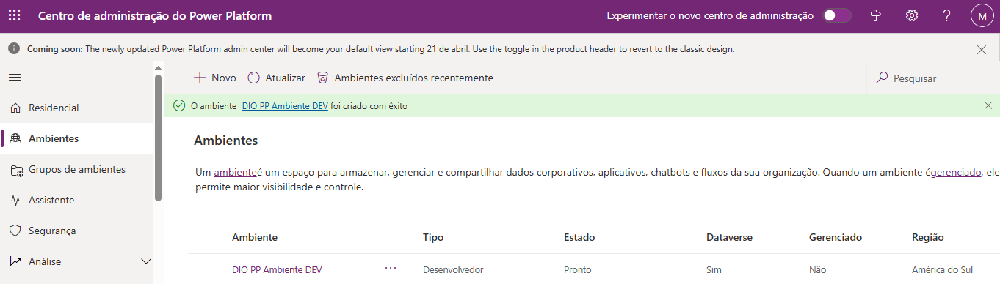
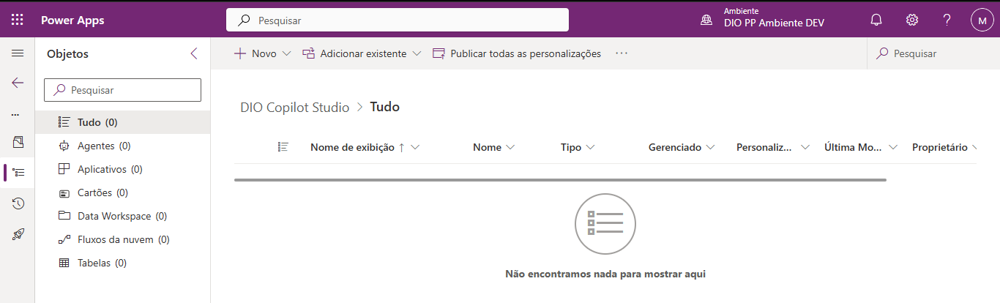
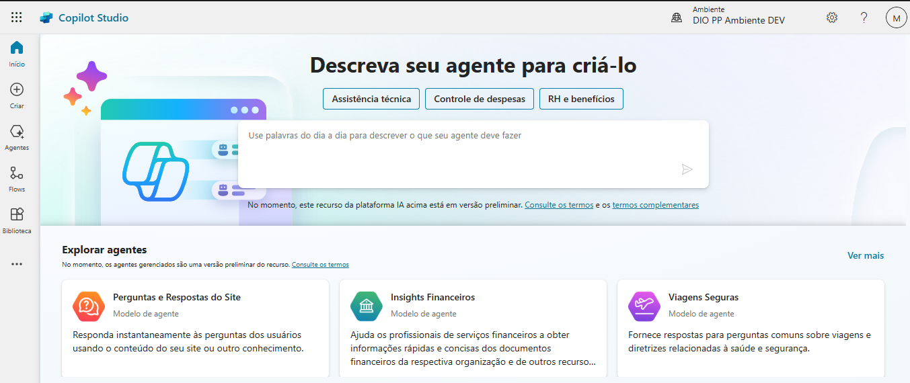
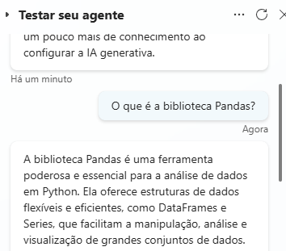

# 🚀 Meu Primeiro Copiloto: Assistente de Engenharia de Dados com Copilot Studio 🤖

Bem-vindo(a) ao repositório do meu projeto de estreia no mundo dos copilotos! Este projeto foi desenvolvido como parte do curso **"Criando seu primeiro Copiloto no Microsoft Copilot Studio"**, ministrado pelo professor **[Renato Romão de Souza](https://www.linkedin.com/in/renatoromao/)**, dentro do **Bootcamp [Suzano](https://www.linkedin.com/company/suzano/posts/?feedView=all) - Python Developer** na plataforma da **[DIO](https://www.dio.me/)**.

 

## ✨ Sobre o Projeto

Imagine ter um assistente virtual especialista sempre pronto para tirar suas dúvidas sobre o universo da Engenharia de Dados? Essa foi a missão! Criei um agente inteligente, batizado carinhosamente de **"DIO"**, utilizando o **Microsoft Copilot Studio**.

O objetivo principal foi construir um copiloto capaz de responder perguntas sobre temas essenciais para quem está começando (ou aprimorando seus conhecimentos) em:

*   🐍 **Linguagem de Programação Python**
*   🐼 **Biblioteca Pandas** (essencial para manipulação de dados!)
*   🧱 **Databricks** (plataforma unificada para dados e IA)
*   📊 **Conceitos Gerais de Engenharia de Dados**

 

## 🛠️ A Jornada de Criação (O Processo)

A construção do agente "DIO" seguiu os passos aprendidos no curso, utilizando as ferramentas da Power Platform:

1.  **Configuração do Ambiente:** Primeiro, criei um ambiente dedicado no Centro de Administração do Power Platform, chamado `DIO PP Ambiente DEV`, para isolar e gerenciar os recursos do projeto.
   

    

  
2.  **Explorando o Power Apps/Copilot Studio:** Naveguei pela interface inicial, preparando o terreno para a criação do agente.

    

3.  **Criação do Agente "DIO":** Utilizei o Copilot Studio para dar vida ao agente.

    

    
4.  **Definindo a Personalidade e Conhecimento:**
    *   **Nome:** DIO
    *   **Descrição:** "Esse agente responderá dúvidas sobre Python, biblioteca Pandas, Databricks e sobre a área de Engenharia de Dados."
    *   **Instruções Gerais:** "Esse agente agirá de forma educada e especialista em Engenharia de Dados para um aluno iniciante da área. Esse agente responderá dúvidas sobre Python, Pandas, Databricks e sobre a área de Engenharia de Dados." (Isso ajuda a IA Generativa a moldar o tom e o foco das respostas).

    

5.  **Testando o Conhecimento:** Realizei testes para verificar a capacidade do agente em responder perguntas dentro do escopo definido. O teste com a pergunta "O que é a biblioteca Pandas?" foi um sucesso!

    

 

## 🧠 Inteligência em Ação

O agente utiliza a **IA Generativa** configurada no Copilot Studio para compreender as perguntas e fornecer respostas informativas e contextuais, agindo como um tutor virtual.

**Exemplo de Interação:**

> **Usuário:** O que é a biblioteca Pandas?
>
> **Agente DIO:** A biblioteca Pandas é uma ferramenta poderosa e essencial para a análise de dados em Python. Ela oferece estruturas de dados flexíveis e eficientes, como DataFrames e Series, que facilitam a manipulação, análise e visualização de grandes conjuntos de dados.

 

## 💡 Tecnologias Utilizadas

*   **Microsoft Copilot Studio:** Plataforma low-code para criação e gerenciamento de copilotos.
*   **Microsoft Power Platform:** Ambiente integrado que hospeda o Copilot Studio e outros serviços.
*   **IA Generativa:** Tecnologia subjacente que permite ao copiloto gerar respostas inteligentes.

 

## 🙏 Agradecimentos

*   Ao instrutor **[Renato Romão de Souza](https://www.linkedin.com/in/renatoromao/)** pela didática e conhecimento compartilhado.
*   À **[Digital Innovation One (DIO)](https://www.dio.me/)** pela oportunidade e pela plataforma incrível.
*   À **[Suzano](https://www.linkedin.com/company/suzano/posts/?feedView=all)** pelo patrocínio do Bootcamp.

 

## 👨‍💻 Expert

    
    
&nbsp&nbsp&nbspMarcos Winther 
    &nbsp&nbsp&nbsp
    <a href="https://github.com/MarcosWinther">
    GitHub</a>&nbsp;|&nbsp;
    <a href="https://www.linkedin.com/in/marcoswinthersilva/">LinkedIn</a>
    

  

---

⌨️ com 💜 por [Marcos Winther](https://github.com/MarcosWinther)